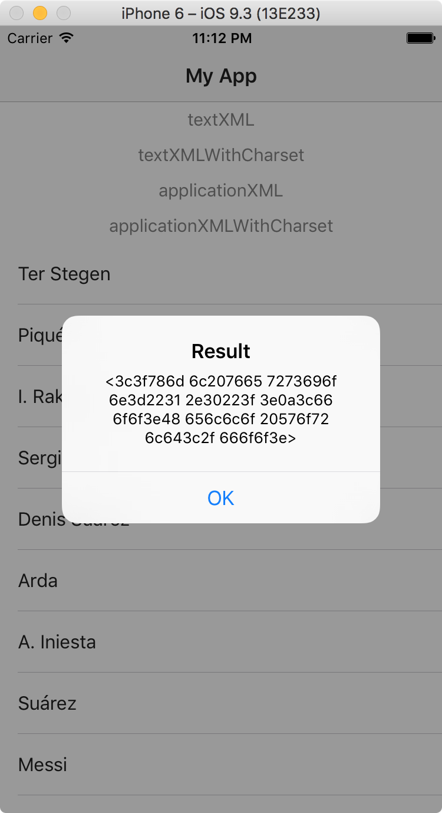
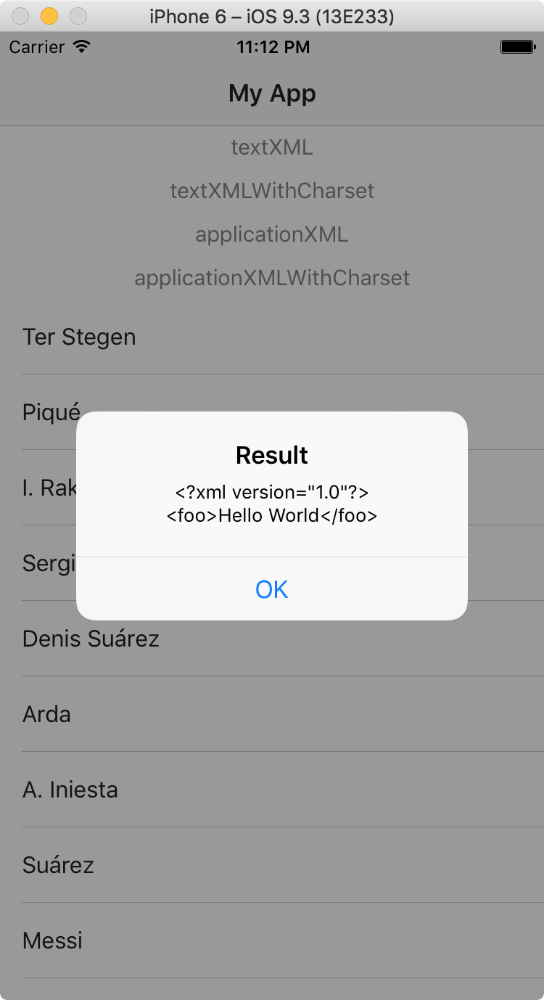

# Support for `text/xml`

Our api returns a http response with header `Content-Type` `text/xml`

The current nativescript implementation of [xhr](https://github.com/NativeScript/NativeScript/blob/master/tns-core-modules/xhr/xhr.ts#L131) does't support `text/xml` 

the RFC ([3023](http://www.rfc-editor.org/rfc/rfc3023.txt)) speficies under section 3, XML Media Types:
> If an XML document -- that is, the unprocessed, source XML document -- is readable by casual users, text/xml is preferable to application/xml. MIME user agents (and web user agents) that do not have explicit support for text/xml will treat it as text/plain, for example, by displaying the XML MIME entity as plain text. Application/xml is preferable when the XML MIME entity is unreadable by casual users.

According to the RFC the `text/xml` should be treated as plain text. 

So when executing a http request with Angular the expected result is a string with plain text
```typescript
getTextXML(): Observable<String>{
    return this.http.get('http://mockbin.org/bin/ebed6ca6-f882-4843-847d-b5d6767116d9')
        .map((res: Response) => res.text());
}
```

But the result of a http request with `Content-type` `text/xml` results in a string with hex values.

Result of `response.text()` with `Content-Type` `text/xml`:


Result of `response.text()` with `Content-Type` `application/xml`:


## Endpoints
[Mock endpoint with `Content-Type` `text/xml`](http://mockbin.org/bin/ebed6ca6-f882-4843-847d-b5d6767116d9/view)

[Mock endpoint with `Content-Type` `application/xml`](http://mockbin.org/bin/f2b097e0-8ee0-4366-b4e9-b5343acfedd8/view)
